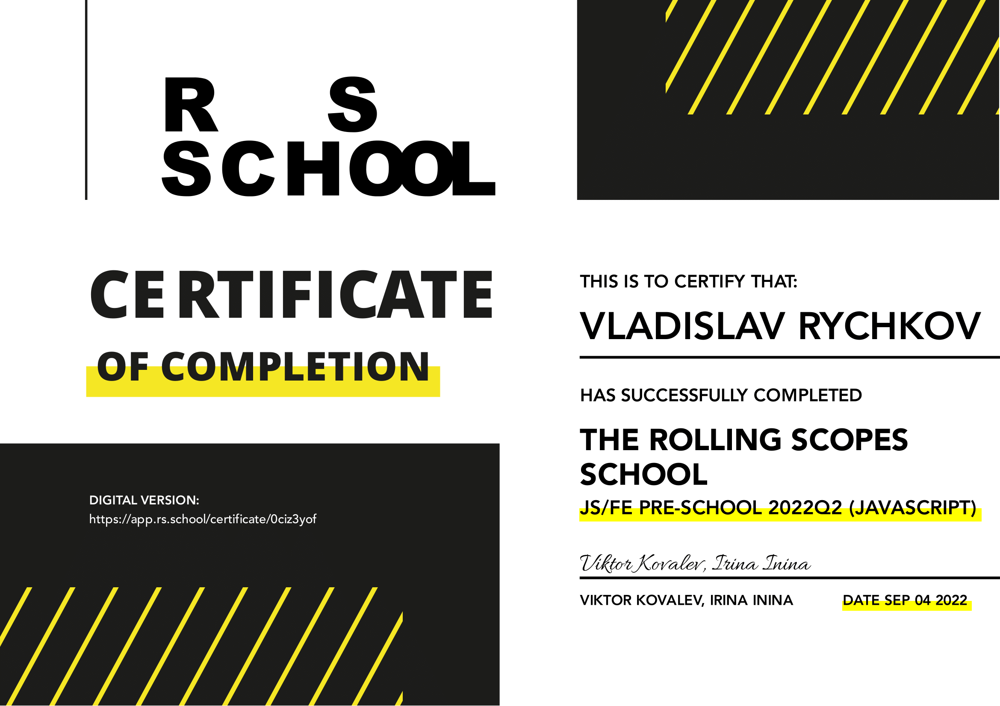

# [rsschool-cv](https://github.com/RVladislavv)
# Vladislav Rychkov


### **Junior WEB Developer**
****
### **Contacts:**
**Phone:** +79608079494(RU) +77055302770(KZ)

**E-mail:** vvrych3@gmail.com

**Discord:** RVladislavv#7137

***

### **About Me:**
I've liked programming since high school. 

When I was in the 11th grade of school, I did not know which university and what specialty to enroll in. 

I started learning HTML and CSS. I didn't study it deeply at that time, because it seemed to me that website builders(like lpgeneration, wix and etc) would displace web studios. After that, I was engaged in advertising for a couple of years. I had to take ready-made website templates and change data, pictures, text - this is how I practiced HTML and CSS.

When the coronavirus started in 2020, I got sick and realized that I didn't like what I was doing.
In 2021, I decided to start studying web development in more depth.

I want to become a strong developer and make cool projects
***

### **Skills:**
* HTML5, CSS3, SCSS/SASS

* JavaScript, React(basics)

* PHP and SQL basics

* Linux and Bash basics

* Git, GitHub, GitLub

* PhpStorm, VS Code, Vim

* Figma, Adobe Photoshop

***

### **Code Examples:**

Create a function that takes an integer as an argument and returns "Even" for even numbers or "Odd" for odd numbers.

```
function even_or_odd(number) {
    return number % 2 ? "Odd" : "Even";
}
```

***

### **Experience:**
As I wrote in About Me, I edited landing pages: I changed fonts, colors, images, text, titles, links - when I was advertising on Facebook and Google.

[Sample tutorial project on Udemy](https://rvladislavv.github.io/)

[Project in RS shool](https://rolling-scopes-school.github.io/rvladislavv-JSFEPRESCHOOL2022Q2/travel/)

[Second project in RS shool](https://rolling-scopes-school.github.io/rvladislavv-JSFEPRESCHOOL2022Q2/momentum/)

***

### **Education and courses:**
* University:

    * Moscow Witte University (Gave up in the second year of study - Advertising and public relations)

* Sololearn


* Udemy:


    * [HTML/CSS](https://www.udemy.com/course/webdeveloper)


    * [JavaScript (in progress)](https://www.udemy.com/course/javascript_full/)


* FreeCodeCamp


* Code-basics


* RS School: 


    * JS/FE Pre-School 2022 

***

### **Languages:**
* **Russian:**  native

* **English:**
B1(Intermediate - EFSET test)

Since childhood I have been learning English periodically. I was in a camp where everyone spoke English. I worked in sales, where I communicated in English.


